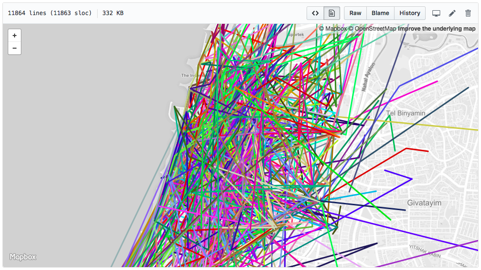

### Tracking and analyzing [bird](https://bird.co) scooter locations across Tel Aviv

- [x] Heatmap visualization of bird locations during a given day.
- [x] Analyze bird usage durations and patterns.
- [ ] Add a date picker to the heatmap demo.
- [ ] Predict the chances of finding a bird at a given time and location.

One day of TLV Birds location heatmap - [demo](https://idoco.github.io/birding/heatmap_demo/)

Full timeline GeoJson - [link](examples/timeline_example.geojson)

### Key concepts

- Data is collected from publicly available sources. There are already several websites tracking birds locations around the world.
- If you want to track the birds yourself, see [my example](lambda.js) for using the `bird/nearby` API (which is basically the same as refreshing the app and registering locations every 5 minutes).
- The collected data is somewhat noisy. Inconsistent GPS signals and maintenance operations might look like bird rides. The data is cleaned by using a few heuristics:
  - Minimal bird ride is at least 100 meters long.
  - No ride is shorter than 1 minute.
  - Rides consume at least 1% of battery power.

### Usefull commands

Copy data from s3 - `aws s3 cp s3://birds-locations/${date} ./data/${date} --recursive`

Generate heatmap data - `node heatmap.js ./data/${date} > heatmap_demo/heatmap_data.js`

Analyze bird daily usage - `node ride-stats.js ./data/${date}`

Daily usage report as CSV - `node ride-stats.js ./data/ csv`

Generate GeoJSON of bird movment - `node geojson.js ./data/${date}/ ${birdCode} > test.geojson`
